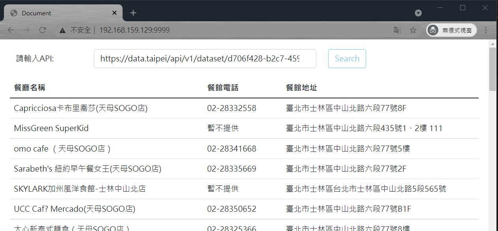

## 上傳檔案至 Ubuntu
目錄 : 
/home/ubuntu/homework/src

---
## 建立 dockerfile 檔案
至 /home/ubuntu/homework 建立 dockerfile
#### <font color=red>檔名固定為 dockerfile </font>


以 nginx 這個 imge 為基底

將檔案從**host路徑**複製到

**container中的 nginx 路徑**

檔案內容如下
```
FROM nginx
COPY src /usr/share/nginx/html
```

---
## build 一個 image 
**<font color=red>路徑就好,不用 dockerfile 檔名</font>**
```
docker image build /home/ubuntu/homework -t 自訂image名稱
```

---
## 用 自訂image名稱 run 一個 container
```
docker container run --name hw -p 9999:80 -d 自訂image名稱
```

---

## 執行結果
