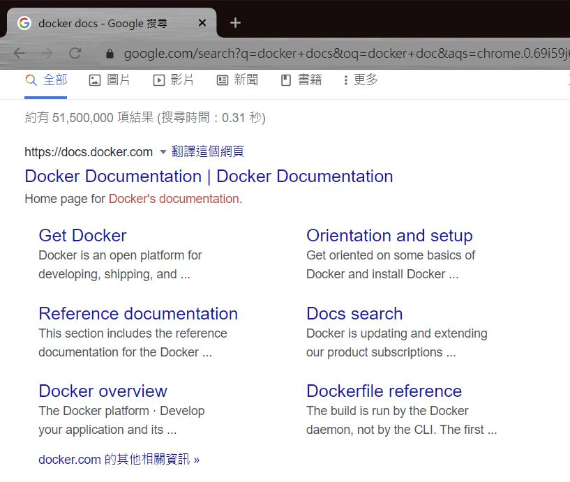
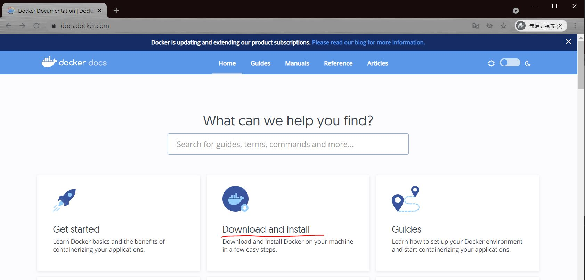
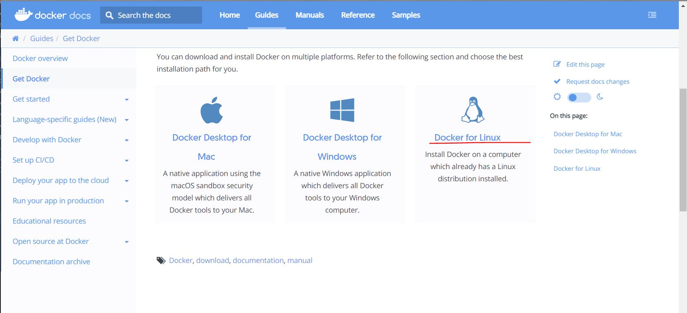
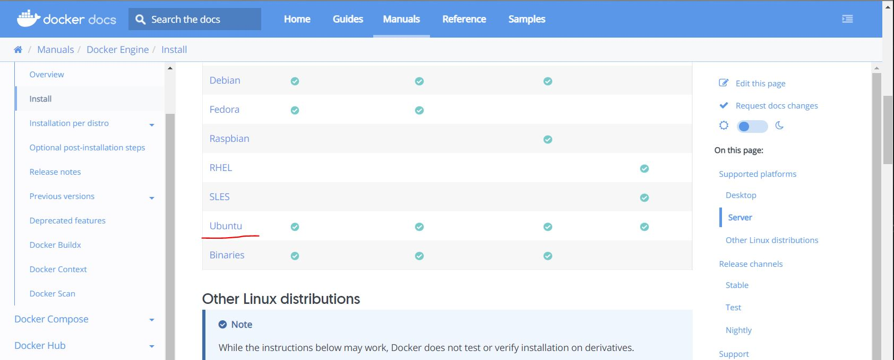
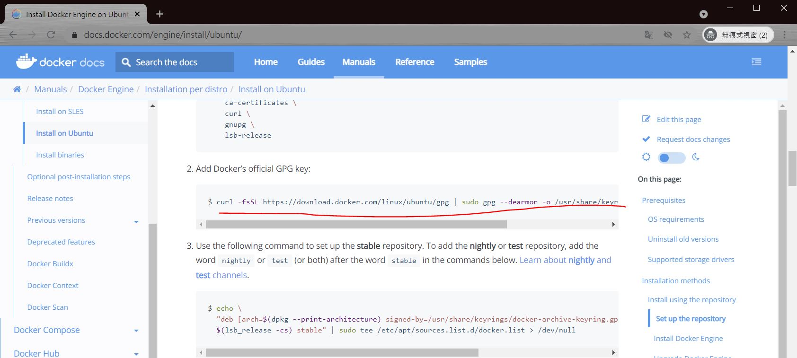
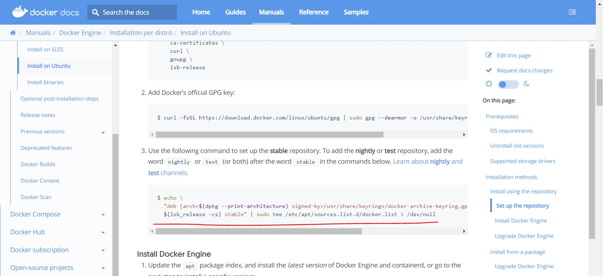

# docker 安裝

## 搜尋 docker docs 找安裝指令





---

## 金鑰指令


複製指令, 去除 sudo 後如下 
```
curl -fsSL https://download.docker.com/linux/ubuntu/gpg | gpg --dearmor -o /usr/share/keyrings/docker-archive-keyring.gpg
```


---

## 倉庫清單指令



複製指令, 去除 sudo 後如下 
```
echo \
  "deb [arch=$(dpkg --print-architecture) signed-by=/usr/share/keyrings/docker-archive-keyring.gpg] https://download.docker.com/linux/ubuntu \
  $(lsb_release -cs) stable" | tee /etc/apt/sources.list.d/docker.list > /dev/null
```

---

## 更新倉庫
```
sudo apt update
```

## install
```
sudo apt install docker-ce
```