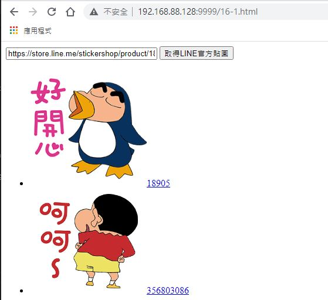

# php + dockerfile

## 準備檔案 
- ext\tts\fetch.html
- ext\tts\jquery.highlight-within-textarea.css
- ext\tts\jquery.highlight-within-textarea.js
- ext\tts\sound.php
- ext\linestickers\linestickers.php
- ex\16-1.html

如下圖


---

## 修改 sound.php

- 調整 URL與 Json 如下圖


- 修改如下


---

## 修改 fetch.html
```
https://darreninfo.cc/tts/sound.php
改為
sound.php
```

## 修改 fetch.html
```
https://darreninfo.cc/linestickers.php
改為
linestickers.php
```
---


## 上傳檔案至 Ubuntu
目錄 : 
/home/ubuntu/php/src

---
## 建立 dockerfile 檔案
至 /home/ubuntu/homework 建立 dockerfile
#### <font color=red>檔名固定為 dockerfile </font>


- 以 php:8.0-apache 這個 imge 為基底

- 將檔案從**host路徑**複製到 **container中的 apache 路徑**

- 建立 tmp 資料夾

- 設定tmp 資料夾權限

檔案內容如下
```
FROM php:8.0-apache
COPY src /var/www/html
RUN cd /var/www/html
RUN mkdir tmp
RUN chmod a+rxw /var/www/html/tmp
```


---
## build 一個 image 
**<font color=red>路徑就好,不用 dockerfile 檔名</font>**
```
docker image build /home/ubuntu/php -t 自訂image名稱
```

---
## 用 自訂image名稱 run 一個 container
```
docker container run --name php -p 9999:80 -d 自訂image名稱
```

---

## 執行結果

- fetch.html


- 16-1.html


